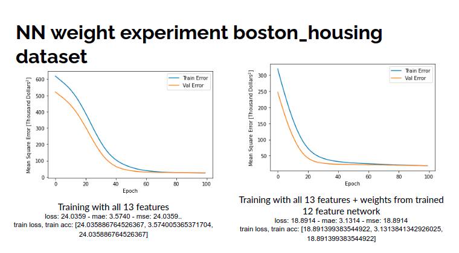

# Minimise Required Training Data

    

An experiment to see how little training data is required to train a network with a new feature, given that there already exists a pretrained network predicting the same quantity without this new feature.

# Methodology

Dataset : boston_housing
It has 13 features and 1 predicted value

Trained 3 ANNs
1. M1 Input 13 - Vanialla training
2. M2 Input 12 - Dropped the last column of the feature set, then Vanialla training
2. M3 Input 13 - Took weights from M2 and then trained 